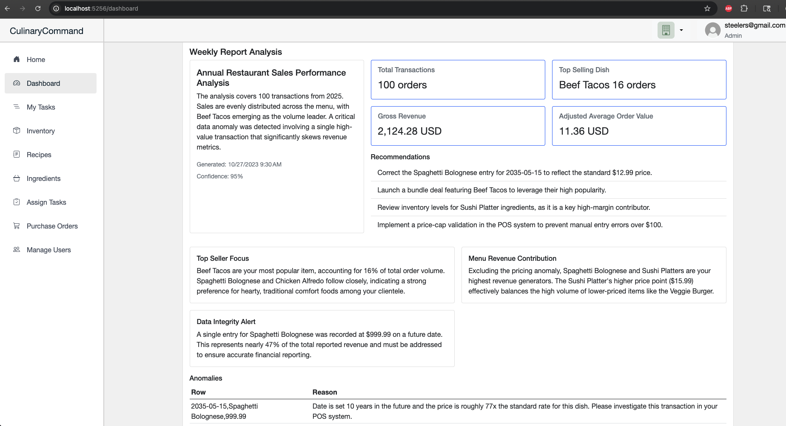


- Follow the guidelines in https://docs.github.com/contributing/writing-for-github-docs/content-model#conceptual to write this article.
- Great intros give readers a quick understanding of what's in the article, so they can tell whether it's relevant to them before moving ahead. For more tips, see https://docs.github.com/contributing/writing-for-github-docs/content-model
- For product callout info, see https://github.com/github/docs/tree/main/content#product
- For product version instructions, see https://github.com/github/docs/tree/main/content#versioning
- Remove these comments from your article file when you're done writing.


## Introduction

This page serves as the central location for all Culinary Command related documentation. 

Github uses Ruby + Jekyll to generate and host this page. More specifically, Github looks at whatever is in the `CulinaryCommand/docs/` directory and deploys it.

## How To Contribute

All related information to documentation is located under the `docs/` directory. `index.md` is where all of the content is loaded from, so, if you want to add information, that is the file you want to edit. `_config.yml` serves as a configuration file that Github reads the theme from. 

## Table of Contents

- [Introduction](#introduction)
- [How To Contribute](#how-to-contribute)
- [Table of Contents](#table-of-contents)
- [Terraform {#terraform}](#terraform-terraform)
- [Analytics Reporting Dashboard {#dashboard}](#analytics-reporting-dashboard-dashboard)
- [HTTPS Configuration {#HTTPS-configuration}](#https-configuration-https-configuration)
## Terraform {#terraform}

[Terraform](https://developer.hashicorp.com/terraform) is an Infrastructure as Code (IaC) tool that deploys all AWS related infrastructure. This is automatically done through the CI/CD pipeline.

<!-- Files -->

Files

The Terraform configuration for this project lives in the repository's `terraform/` folder. Key files you will find here:

- `main.tf` — primary configuration and resource definitions.
- `lightsail.tf` — contains provider/service specific resources.
- `variables.tf` — documents configurable inputs.
- `outputs.tf` — exposes useful values for downstream use (useful for CI/CD and app config).
- `provider.tf` or backend configuration — (if present) provider and state backend settings.

<!-- Purpose -->

Purpose

This directory provisions the project's cloud environment. As of now, it is responsible for deploying the lightsail instance that we use to host Culinary Command.

<!-- How to use -->

Getting started

The `terraform/` directory will only be changed when there needs to be infrastructure changes. For Culinary Command, it has been configured to automatically deploy infrastructure changes (via CI/CD). To get started, refer to [the official Terraform documentation](https://developer.hashicorp.com/terraform/intro). If you have any questions, reach out to Kevin.

## Analytics Reporting Dashboard {#dashboard}

Currently, the `Weekly Report Analysis` section leverages the Gemini API to do static analysis on a CSV file `test_data.csv`. This CSV file contains 100 lines of basic order data.

In `AIDashboard/Services/Reporting/AIReportingService.cs`, there is a function `AnalyzeCsvAsync` that constructs the prompt, calls the Gemini API using the prompt, and returns the response for us to use. The dashboard component `CulinaryCommandApp/Components/Dashboard.razor` uses this to display the information that we see here: 

**Note that this is temporary as the information is not reliable.**

## HTTPS Configuration {#HTTPS-configuration}

The lightsail instance leverages a [reverse proxy](https://www.cloudflare.com/learning/cdn/glossary/reverse-proxy/) via Nginx to intercept HTTP traffic and points it the Blazor web app. The configuration for this can be found in the lightsail instance directory: `/etc/nginx/sites-available/culinarycommand`.

SSL certificates are provided by `Let's Encrypt/Certbot` and will have to be rotated every 3 months. Once the team decides to migrate to different infrastructure, `Caddy` will most likely be used since it handles configuration and SSL certificate rotation.

Useful resources/documentation:
- [Nginx configuration on Ubuntu](https://www.digitalocean.com/community/tutorials/how-to-install-nginx-on-ubuntu-20-04#step-5-%E2%80%93-setting-up-server-blocks-(recommended))
- [Initial server setup](https://www.digitalocean.com/community/tutorials/initial-server-setup-with-ubuntu-20-04) (only referenced Step 4)
- [Using Nginx with Let's Encrypt & Ubuntu](https://www.digitalocean.com/community/tutorials/how-to-secure-nginx-with-let-s-encrypt-on-ubuntu-20-04)
- [Certbot getting started](https://certbot.eff.org/instructions?ws=nginx&os=snap)
- [Let's Encrypt getting started](https://letsencrypt.org/getting-started/)

**Reach out to Kevin if you have any questions!**

